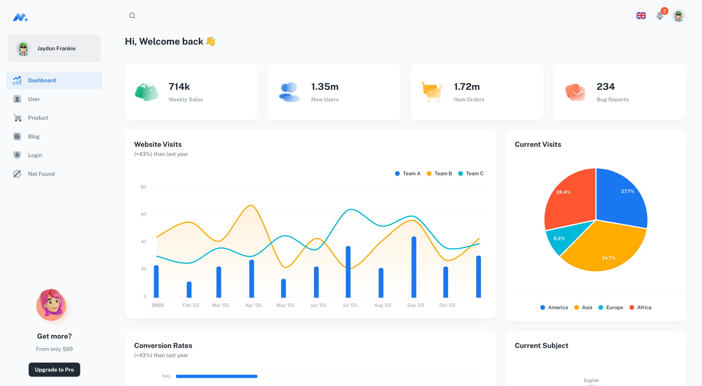

## Admin Panel COMICI [(version beta)](https://admin-comissi.shouz.network/)

> React App avec Material-UI & ANTD.

## Demo

- [Dashboard Page](https://admin-comissi.shouz.network/)
- [Competition Page](https://admin-comissi.shouz.network/voting)
- [Actuality Page](https://admin-comissi.shouz.network/blog)
- [Admin Page](https://admin-comissi.shouz.network/users)
- [Login Page](https://admin-comissi.shouz.network/login)
- [Not Found Page](https://admin-comissi.shouz.network/404)

## Quick start

- Clone Repo
- Recommended `Node.js v20.x`.
- **Install:** `yarn install`
- **Start:** `yarn dev`
- **Build:** `yarn build`

## License

Distributed under the MIT License. See [LICENSE](https://admin-comissi.shouz.network/LICENSE.md) for more information.

## Contact us

Email: support@booztechnologie.com
